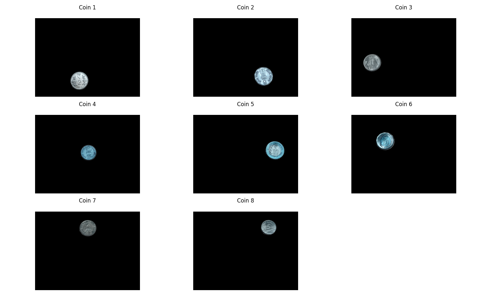

# VR Assignment 1 - Coin Detection and Panorama Creation

This repository contains the implementation of two computer vision tasks:
1. Detection, segmentation, and counting of Indian coins from an image
2. Creation of panoramic images from multiple overlapping photos

## Project Structure
```
├── part1.py           # Coin detection and segmentation implementation
├── part2.py           # Panorama creation implementation
├── requirements.txt   # Project dependencies
├── image/
    ├── part1/        # Contains coin images
    │   └── coins.jpg
    └── part2/        # Contains images for panorama creation
    └── result_part1/ # Contains all resulting image of part 1
    └── result_part2/ # Contains all resulting image of part 2
    
```

## Dependencies

The project requires the following Python packages:
- OpenCV (opencv-python) == 4.11.0.86
- NumPy == 2.2.2
- Matplotlib == 3.10.0

Install dependencies using:
```bash
pip install -r requirements.txt
```

## Part 1: Coin Detection and Segmentation

### Implementation Details

The coin detection and segmentation algorithm follows these steps:

1. **Image Preprocessing**
   - Convert image to grayscale
   - Apply Gaussian blur for noise reduction
   - Perform edge detection using Canny algorithm
   - Use adaptive thresholding for better contour detection

2. **Coin Detection**
   - Find contours in the processed image
   - Filter contours based on minimum area to remove noise
   - Draw outlines around detected coins

3. **Segmentation**
   - Create individual masks for each detected coin
   - Extract individual coin segments
   - Generate visualization of each segmented coin

4. **Coin Counting**
   - Count valid contours to determine the total number of coins
   - Display the count in the console output

### Usage

Run the coin detection script:
```bash
python3 part1.py
```

### Output


*Figure 1: Individual segmented coins of image*


*Figure 2: segmentation and masking*

The script generates multiple visualizations:
- Original image with detected coins outlined in green
- Edge detection result
- Adaptive thresholding result
- Segmentation mask
- Individual segmented coins displayed in a grid

## Part 2: Panorama Creation

### Implementation Details

The panorama creation process involves:

1. **Key Point Detection**
   - Use SIFT (Scale-Invariant Feature Transform) to detect key points
   - Compute descriptors for each key point

2. **Key Point Matching**
   - Implement brute-force matching with k-NN
   - Apply ratio test to filter good matches
   - Visualize matches between consecutive images

3. **Image Stitching**
   - Calculate homography matrix using RANSAC
   - Apply perspective transformation
   - Blend overlapping regions
   - Create final panorama

### Usage

Run the panorama creation script:
```bash
python3 part2.py
```

### Output


*Figure 1: keypoints between images*


*Figure 2: Stitched image*

The script generates:
- Visualization of matched key points between consecutive images
- Final stitched panorama image

